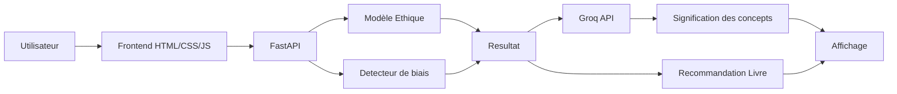
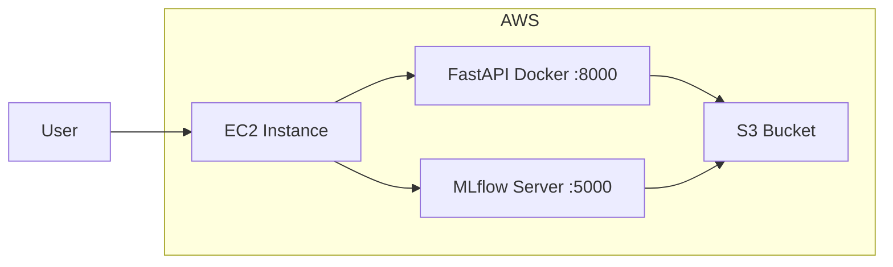
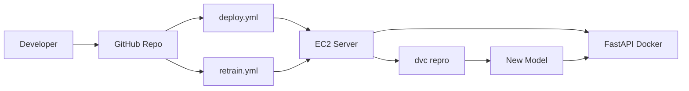
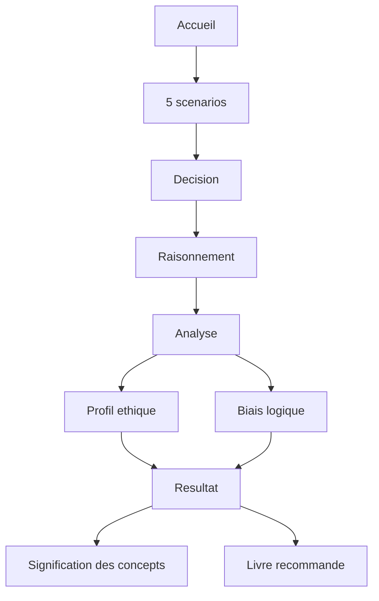

# Socratic — The Ethical Reasoning Game (MLOps Project)

---

## 1. Présentation du projet

**Socratic** est une application web interactive qui analyse le raisonnement humain à travers un jeu philosophique.

L'utilisateur est confronté à **5 scénarios éthiques**, dans lesquels il doit :
- prendre une décision
- choisir une justification

Ces réponses sont ensuite analysées par deux modèles de Machine Learning afin de :
- déterminer un **profil éthique dominant**
- détecter des **biais logiques (fallacies)**
- afficher la signification des concepts détectés (via Groq API)
- recommander un **livre adapté**

Ce projet combine :
- NLP (Natural Language Processing)
- classification supervisée
- pipeline MLOps complet (DVC + MLflow + CI/CD + Docker + AWS)

---

## 2. Architecture technique

L'architecture a été conçue pour être simple, modulaire et reproductible.

Elle sépare clairement :
- l'inférence (API)
- le tracking des modèles (MLflow)
- le stockage des données (S3)
- l'orchestration du pipeline (DVC)

### Diagramme global



---

## 3. Infrastructure Cloud



---

## 4. Pipeline MLOps (DVC)

Le pipeline est entièrement versionné et reproductible grâce à DVC.


---

## 5. CI/CD

Le projet utilise GitHub Actions pour automatiser le déploiement et le réentraînement.



---

## 6. Modèles de Machine Learning

### Modèle 1 — Ethics Classifier

| Propriété | Valeur |
|-----------|--------|
| Objectif | Classifier le raisonnement en théorie éthique |
| Classes | utilitarianism, deontology, virtue ethics, care ethics, egoism |
| Algorithme | Logistic Regression |
| Features | TF-IDF |
| F1-score | 0.84 |

### Modèle 2 — Fallacy Detector

| Propriété | Valeur |
|-----------|--------|
| Objectif | Détecter les biais logiques |
| Classes | 13 types |
| Algorithme | Logistic Regression / LinearSVC |
| Déséquilibre | `class_weight=balanced` |
| F1-score | 0.60 |

---

## 7. Rôle de Groq API

Groq est utilisé uniquement pour afficher la signification des concepts détectés.

Concrètement, il permet :
- d'expliquer brièvement les théories éthiques
- de définir les biais logiques identifiés

Il ne réalise aucune prédiction et n'intervient pas dans les modèles de Machine Learning.

---

## 8. Données

| Dataset | Description |
|---------|-------------|
| `ethics_dataset.csv` | Données équilibrées |
| `fallacy_dataset.csv` | Données déséquilibrées |

### Prétraitement

- nettoyage texte
- fusion des colonnes
- TF-IDF
- encodage labels
- split train/test

---

## 9. Structure du projet

```plaintext
Socratic/
│
├── .dvc/
├── .github/workflows/
│   ├── deploy.yml
│   └── retrain.yml
│
├── api/
│   └── main.py
│
├── src/
│   ├── preprocess.py
│   ├── train.py
│   ├── evaluate.py
│   └── register.py
│
├── scripts/
│   ├── setup.sh
│   └── setup.ps1
│
├── templates/
│   ├── index.html
│   ├── game.html
│   └── result.html
│
├── static/
│   ├── css/style.css
│   └── js/
│
├── data/
├── models/
├── metrics/
│
├── dvc.yaml
├── dvc.lock
├── params.yaml
├── Dockerfile
├── requirements.txt
└── README.md
```

---

## 10. Structure Git

Le projet utilise une organisation en branches :

- `main` : production
- `staging` : intégration
- `dev-XXXX` : développement individuel

Les merges vers `main` déclenchent le déploiement automatique.

---

## 11. Variables d'environnement

Les variables sensibles sont stockées dans GitHub Secrets et non dans le code :

- `EC2_HOST`
- `MLFLOW_TRACKING_URI`
- `AWS_ACCESS_KEY_ID`
- `AWS_SECRET_ACCESS_KEY`
- `GROQ_API_KEY`

Cela garantit la sécurité des credentials.

---

## 12. Installation et exécution

### Cloner le projet

```bash
git clone <repo_url>
cd Socratic
```

### Installer les dépendances

```bash
pip install -r requirements.txt
```

### Lancer le pipeline

```bash
dvc pull
dvc repro
```

### Lancer l'API

```bash
uvicorn api.main:app --reload
```

### Health check

```bash
curl http://localhost:8000/
```

Doit retourner un statut (ex: `{"status": "ok"}`).

### Tester l'API

```bash
curl -X POST http://localhost:8000/predict \
  -H "Content-Type: application/json" \
  -d '{"input": "example"}'
```

L'API retourne une prédiction au format JSON.

---

## 13. Chargement du modèle

L'API charge automatiquement le modèle depuis le MLflow Model Registry :

```python
mlflow.pyfunc.load_model("models:/socratic-model/latest")
```

Cela permet d'utiliser la dernière version validée du modèle sans modifier le code.

---

## 14. Déploiement

### MLflow Tracking Server

Le serveur MLflow est déployé sur une instance EC2 avec :
- stockage local des métadonnées (SQLite)
- stockage S3 pour les artefacts

```bash
mlflow server \
  --host 0.0.0.0 \
  --port 5000 \
  --backend-store-uri sqlite:///mlflow.db \
  --default-artifact-root s3://group4-soc-bucket \
  --serve-artifacts \
  --allowed-hosts "*" \
  --cors-allowed-origins "*"
```

Rôle de MLflow :
- tracking des expériences
- comparaison des modèles
- registry des modèles utilisés en production

### Docker

```bash
docker build -t socratic-api .

docker run -d --name socratic-api --restart always -p 8000:8000 \
  -e MLFLOW_TRACKING_URI=$MLFLOW_TRACKING_URI \
  -e AWS_ACCESS_KEY_ID=$AWS_ACCESS_KEY_ID \
  -e AWS_SECRET_ACCESS_KEY=$AWS_SECRET_ACCESS_KEY \
  -e AWS_DEFAULT_REGION=eu-west-3 \
  -e GROQ_API_KEY=$GROQ_API_KEY \
  socratic-api
```

### Accès aux services

- API : `http://<EC2_IP>:8000`
- MLflow : `http://<EC2_IP>:5000`

---

## 15. Automatisation du setup

Des scripts ont été ajoutés pour simplifier l'exécution :

- `setup.sh` — Linux / EC2
- `setup.ps1` — Windows

Ces scripts permettent de :
- charger les variables d'environnement
- installer les dépendances
- créer les dossiers nécessaires
- récupérer les données depuis DVC

```bash
bash scripts/setup.sh
```

Puis :

```bash
dvc repro
```

---

## 16. Fonctionnement du jeu



---

## 17. Choix techniques

| Choix | Raison |
|-------|--------|
| Logistic Regression | Rapide et efficace sur petit dataset |
| TF-IDF | Adapté au texte court |
| DVC | Versionnage des données et du pipeline |
| MLflow | Tracking et registry des modèles |
| SQLite | Backend léger pour les métadonnées MLflow |
| S3 | Stockage séparé pour les artefacts lourds |
| AWS EC2 | Solution simple et suffisante |

---

## 18. Limitations

- modèle fallacy encore limité (F1 ≈ 0.60)
- dépendance à Groq API (externe)
- dataset restreint

---

## 19. Améliorations futures

Plusieurs pistes d'amélioration ont été identifiées :

- amélioration du modèle de détection de fallacies (Deep Learning type BERT)
- support multilingue natif
- amélioration de l'expérience utilisateur

### DevOps / MLOps

- ajout d'une GitHub Merge Queue pour sécuriser les merges
- amélioration du pipeline CI/CD (validation plus stricte)
- amélioration du déclenchement du retraining

---

## 20. Conclusion

Ce projet met en pratique les concepts MLOps en construisant un pipeline complet, de la donnée brute jusqu'au déploiement d'une API.

L'approche reste simple mais reproductible, ce qui constitue une base solide pour des systèmes plus avancés.